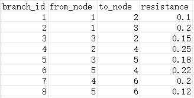
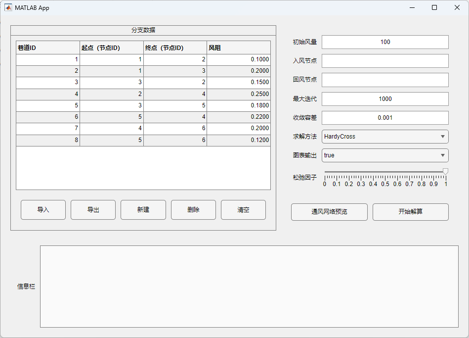
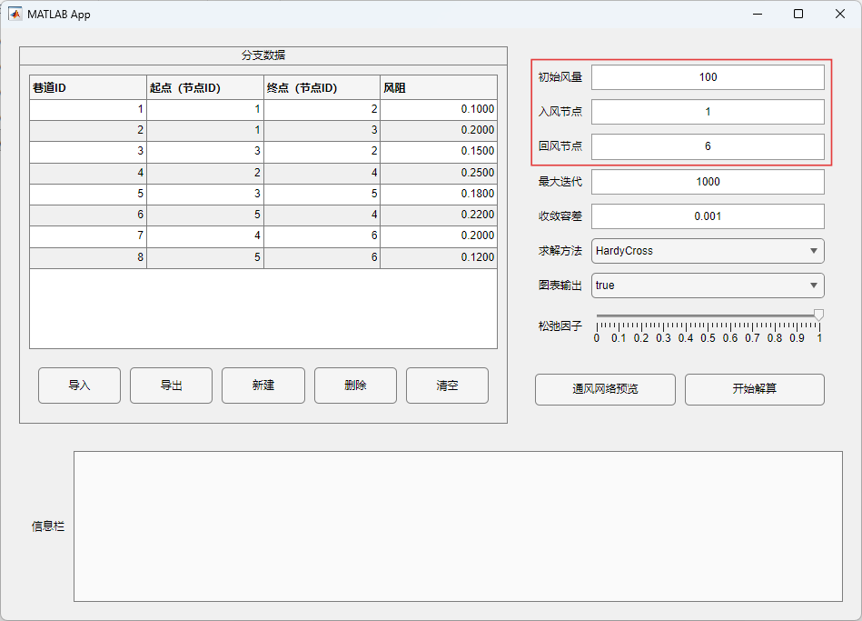
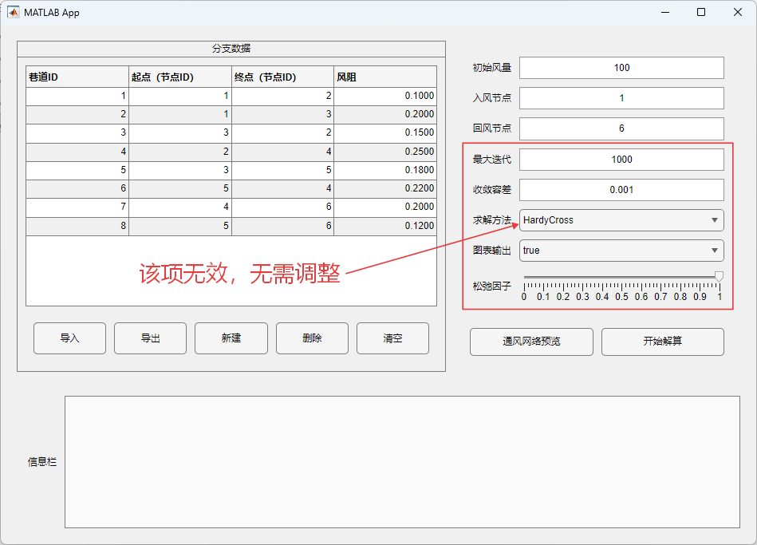
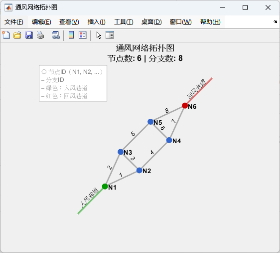

# 05 App 使用方法（App Designer）

本章面向“直接用 App 求解”的使用者，按“启动 → 导入数据 → 设置边界 → 求解 → 可视化/导出”的顺序说明。
若你希望在脚本中批处理或二次开发，请跳到：[06_App外用法.md](06_App外用法.md)。

---

## 1. 前置条件

- MATLAB R2019b 或更高版本（需要 App Designer）。
- 能正常使用 `graph/conncomp/shortestpath` 等图算法函数（用于回路识别与连通性检查）。

---

## 2. 启动方式

### 方式 A：安装 App（推荐）

仓库提供了可安装包（双击安装）：

- `General Problem Solver/ui/SimpleVentilationNetworkSolver_v1.1.0.mlappinstall`
- `General Problem Solver/ui/SimpleVentilationNetworkSolver.mlappinstall`

安装完成后，在 MATLAB 的 Apps 列表中启动。

### 方式 B：直接运行源码 App

在 MATLAB 命令行中：

```matlab
addpath('General Problem Solver');
NetworkSolverApp
```

或直接双击打开：`General Problem Solver/ui/NetworkSolverApp.mlapp`。

> 说明：`General Problem Solver/ui/NetworkSolverApp_exported*.m` 是 App Designer 导出文件，通常用于版本对比；界面修改建议在 App Designer 中完成。

**成功打开的APP界面：**


---

## 3. 数据准备（你需要提供什么）

### 3.1 分支（巷道）表：`Branches`

App 的表格每一行代表一条巷道（分支），核心字段为：

- `ID`：巷道编号（求解器要求为 `1..B` 连续整数）
- `起点`（或 `from_node`）：起点节点编号（定义分支正方向）
- `终点`（或 `to_node`）：终点节点编号
- `风阻`（或 `R/resistance`）：风阻系数（正数）

你可以通过三种方式填充表格：

- **导入 CSV**：点击“导入 CSV”，选择分支 CSV 文件；
- **添加行**：点击“添加行”，在对话框中输入一条分支；
- **直接编辑表格**：双击单元格修改。

CSV 模板可参考：`General Problem Solver/+gps/+data/branches_template.csv`。



本项目提供的测试文件中包含一些头文件，但**不是必需的**，只要含有标准表头（**“branch_id,from_node,to_node,resistance”**）即可。

### 3.2 边界条件：`Boundary`

App 右侧参数区填写：

- **系统总风量** `Q_total`（标量，>0）
- **入风节点** `inlet_node`（标量或多个节点）
- **回风节点** `outlet_node`（标量或多个节点）

注意事项：

- 入风节点与回风节点不能重叠；
- 节点编号必须存在于当前网络节点范围内；
- 多入风/多回风时，当前求解器会将 `Q_total` **平均分配**到各入风节点，并在各回风节点上平均抽出（详见 `General Problem Solver/+gps/+logic/ventilation_network_solver_generic.m`）。

---

## 4. 操作流程（按按钮走一遍）

1) **导入/编辑分支数据**：
   - `ID/from/to/R` 填写完整，且 `ID` 连续!
   - 
   - 
  
2) **设置边界条件**：
   - 填入 `Q_total`、入风节点、回风节点。
   - 

3) （可选）**调整求解器参数**:
  
   - `max_iter`：最大迭代次数（不收敛时可增大）
   - `tolerance`：收敛容差（精度要求更高可减小）
   - `relaxation`：松弛因子 `ω`（振荡时可取 `0.5~0.8` 欠松弛）
   - `verbose`：开启后会输出更详细日志，并可能自动绘图/导出
   - 

4) **点击“求解”**：
  
   - App 会先做数据校验（风阻正数、节点范围、连通性、边界守恒等）；
   - 然后识别基本回路，进行 Hardy Cross 迭代；
   - 过程与结果会输出到界面日志区域（TextArea）。
   - 
   - 
  
5) **可视化**：
  
   - “绘制网络图”：展示网络拓扑（仅用于可视化，图上连线不代表求解方向）；
   - 
   - “柱状图”等结果图：展示各巷道风量与压降（若启用 verbose 或按界面功能触发）。
   - 

6) **导出**：
  
   - “导出 CSV”：将当前表格内容导出为分支 CSV，便于复用；
   - 结果导出：导出包含 `ID/起点/终点/风阻/风量/风压降` 等列的结果 CSV（具体列以当前导出函数为准，见 `General Problem Solver/+gps/+ui/export_solution_to_csv.m`）。
   - 下图中表格各列依次为：“巷道ID、起点、终点、风阻、风量、风压降”
   - 

---

## 5. 常见问题（建议先看这里）

- **提示“网络不连通”**：说明存在孤立子图；可先用“绘制网络图”定位，再补齐缺失连接。
- **提示 `Branches.id` 必须为 `1..B`**：请把巷道编号整理为从 1 开始的连续整数（可在表格中修改后再导出）。
- **不收敛/振荡**：增大 `max_iter`，减小 `relaxation`，或放宽 `tolerance`；同时检查是否存在极端风阻（过大/过小）或不合理拓扑。

---

## 6. 下一步：在 App 外复用/扩展

**如果你想做批量计算、参数扫描、接入自定义绘图或把求解器嵌入别的工程，请阅读：**

- [06_App外用法.md](06_App外用法.md)
- [gps/OutAppUse.md](gps/OutAppUse.md)
- [gps/Functions.md](gps/Functions.md)
